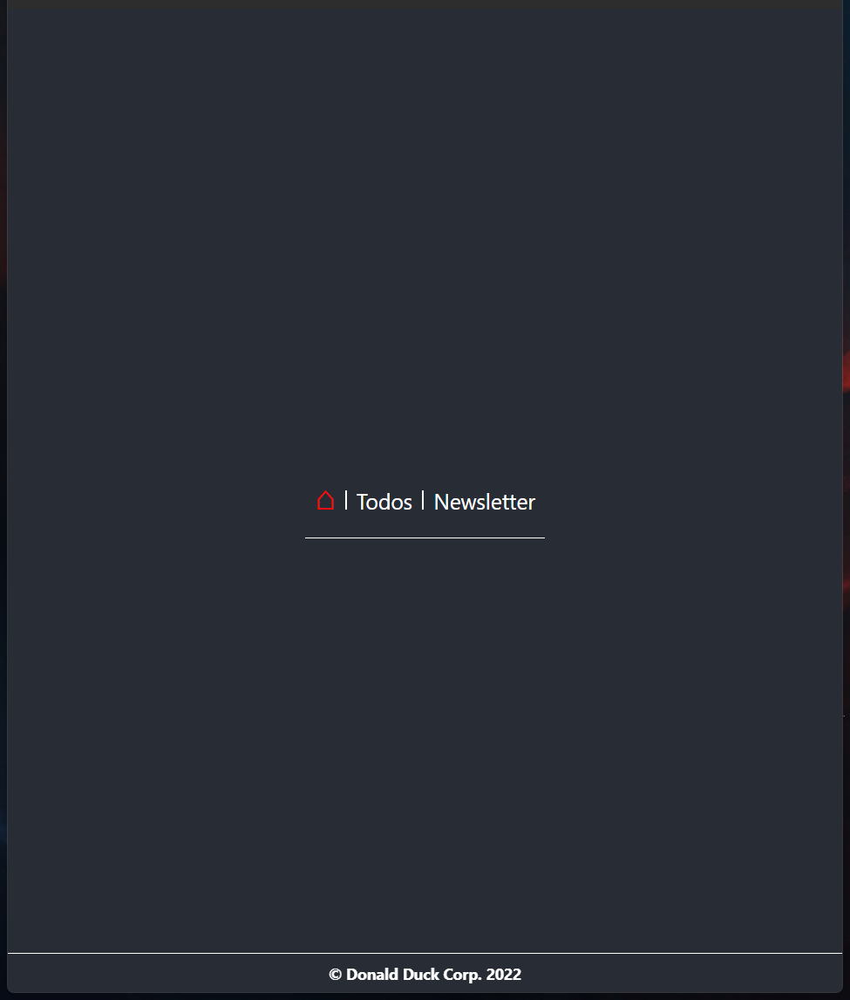
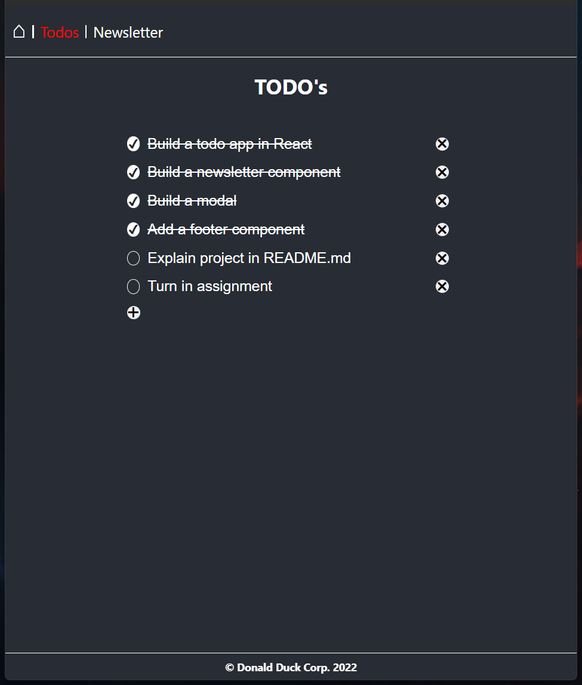
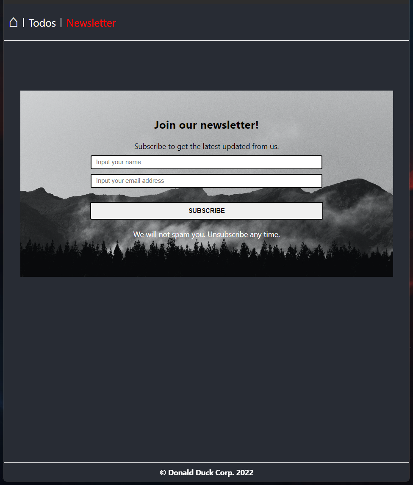
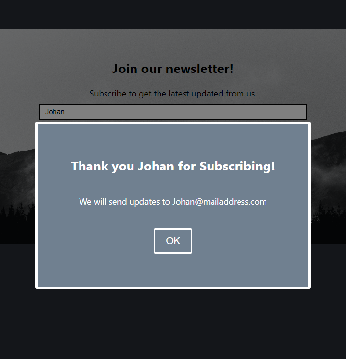

# React WIN21 Inlämning

This assignment focuses on creating a React SPA using the create-react-app and react-route packages.

## Home

The home route only showing the navbar and footer components that is visible on every route.

## Todos

Todo route showing the `TodoList` component.  
Contains a array of `todos` set with `useState` that will re-render every time you access the route, so any changes will not be saved will navigating the route. The component allows you to add, delete and check todos as completed.

## Newsletter

Newsletter route showing the `SignUp` component.  
A simple form for signing up to a fictional newsletter. Uses `useState` to set the `namn:string, email:string and showModal:boolean.` They are used to pass this strings and "bool state" to the child component `SignUpModal`

### Modal

`SignUpModal` is a child component to `SignUp`.

A component taking in the parameters `({mName, mEmail, open, onClose})` to show who has signed up to the email using `mName and mEmail`, an extra "confirmation for the user". `open` property "true" will open the modal, and onClose function used to set `open` property to false.

Deadline: 14 Sept 2022
